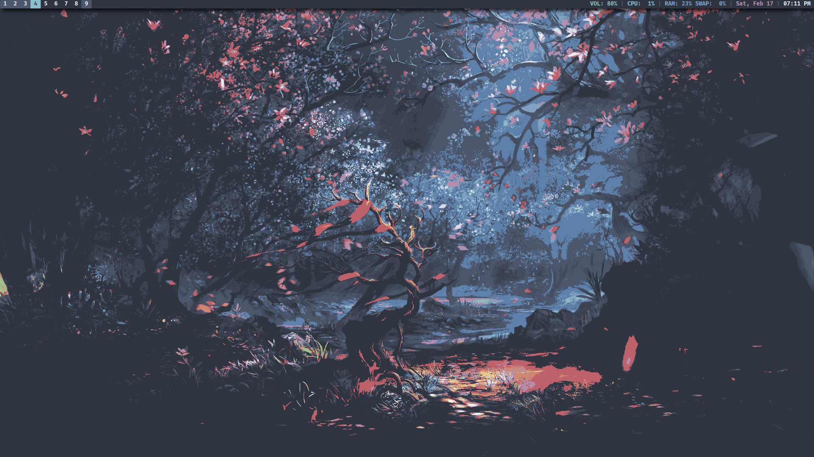
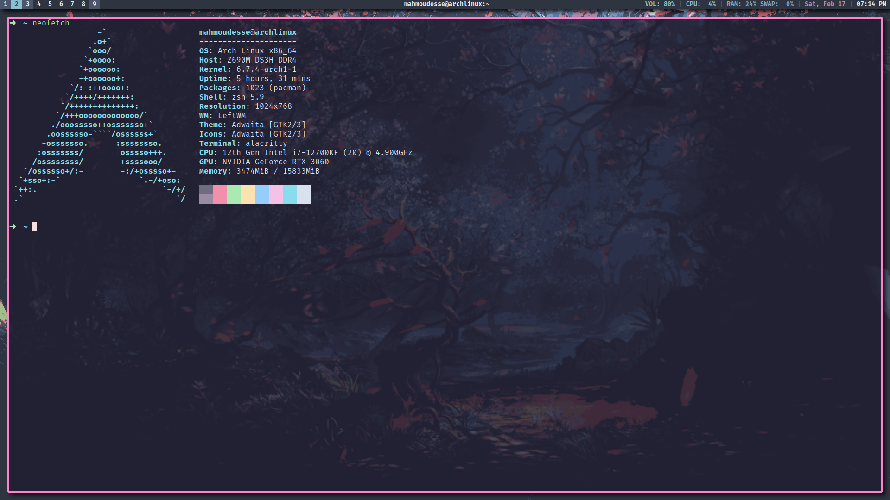

# Ascent

A theme centered around the [Nord Theme](https://nordtheme.com) color palette.
forked from `mWalrus`'s theme [Ascent](https://gitlab.com/mWalrus/ascent)

Based on the ascent theme from leftwm-theme customized to run my own config.

## Screenshots

## Dependencies

- leftwm
- polybar
- feh
- rofi
- dunst

## Installing

1. `git clone https://github.com/MahmoudESSE/Ascent.git`
2. `ln -s $PWD/ascent $HOME/.config/leftwm/themes/current`
3. Reload LeftWM
